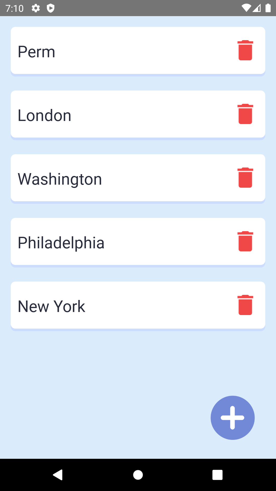
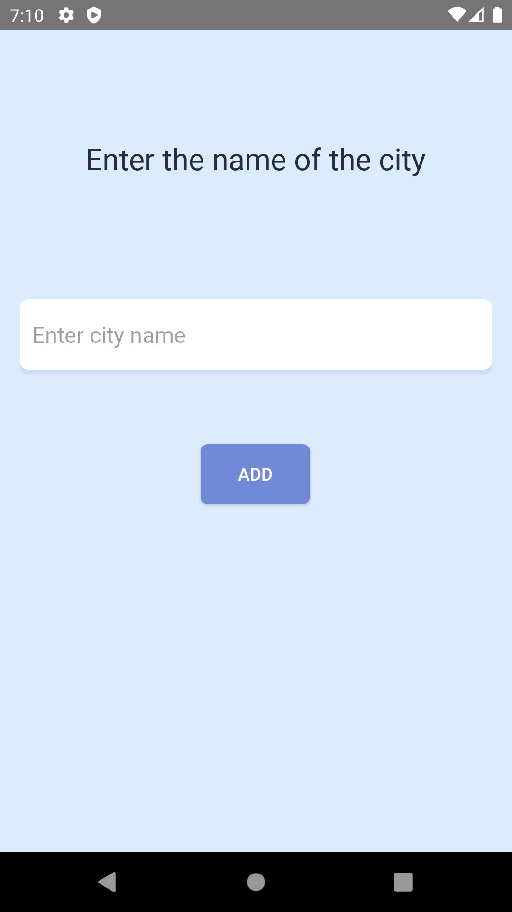
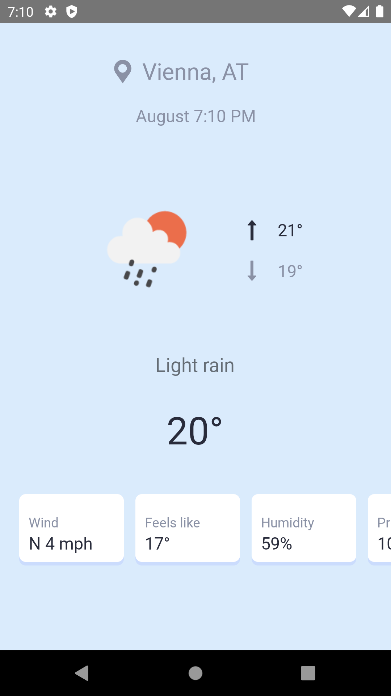

# Weather

A weather application for Android what uses the Open Weather API. Get the current weather for a particular location

## Application architecture
Based on MVVM architecture and repository pattern

## Application specs
- Minimum SDK 23
- [Java8](https://java.com/en/download/faq/java8.xml)
- MVVM Architecture

## Dependencies

- [Retrofit](https://github.com/square/retrofit "Retrofit")
- [Gson](https://github.com/google/gson "Gson")
- [RxJava](https://github.com/ReactiveX/RxJava "RxJava")
- [Toothpick](https://github.com/stephanenicolas/toothpick "Toothpick")
- [Picasso](https://github.com/square/picasso "Picasso")
- Room

## Screenshots

  
